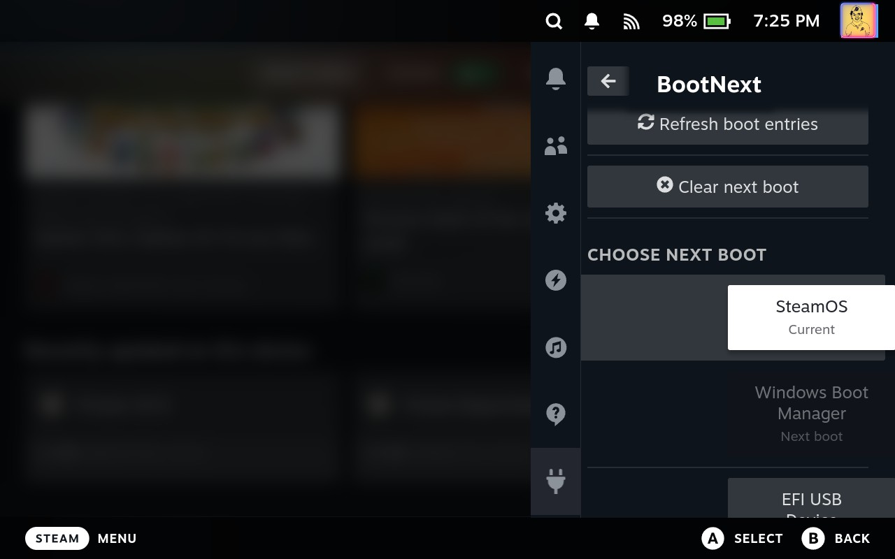

# BootNext for Decky

BootNext is a Decky Loader plugin for selecting which UEFI boot entry will be used on the next boot.

It sets the UEFI `BootNext` variable without changing the normal `BootOrder`, making it convenient to switch temporarily between SteamOS, Windows, and other bootable entries.



## Features

- Lists available UEFI boot entries
- Shows the current and next boot entries
- Sets a boot entry for the next boot only
- Optionally restarts immediately after selecting an entry
- Clears the next-boot override to restore the normal boot order

## Requirements

### Running

- Steam Deck running SteamOS
- Decky Loader

### Deploying

- `ssh`
- `rsync`

### Building from source

- Node.js
- pnpm 9

## Building

Install the dependencies and build the frontend:

```sh
pnpm install
pnpm run build
```

## Deploying

The deployment script copies the required runtime files to the Deck and restarts Decky Loader.

To build and deploy the plugin from source:

```sh
pnpm run deploy
```

This builds the frontend before invoking the deployment script.

If the plugin has already been built, or you downloaded and extracted a prebuilt release, deploy it directly:

```sh
./scripts/deploy.sh
```

By default, the script connects to `deck@steamdeck` and installs the plugin in:

```text
/home/deck/homebrew/plugins/decky-bootnext
```

Connection and installation settings can be overridden using `.deck.env`:

```sh
cp .deck.env.example .deck.env
```

## Creating a release

Build the plugin and create a versioned release archive:

```sh
./scripts/make_release.sh
```

The archive is written to `release/` using the version from `package.json`.

## License

This project is licensed under the terms of the included [LICENSE](LICENSE) file.
